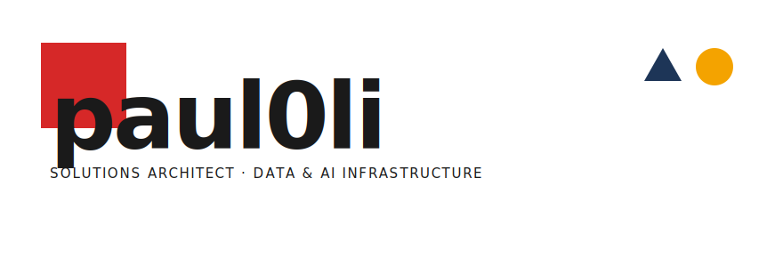
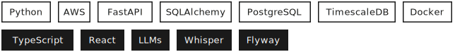

<!-- ============================================================= -->
<!--  paul0li · GitHub profile README — Bauhaus (Layout A)         -->
<!--  Light + dark mode via <picture> + prefers-color-scheme.      -->
<!--  Replace the demo "#" links with your real URLs.             -->
<!-- ============================================================= -->

<picture>
  <source media="(prefers-color-scheme: dark)" srcset="assets/banner-dark.svg" />
  
</picture>

###  &nbsp;About

Solutions Architect — data infrastructure, analytics, and AI.

`B.Sc. Computer Science & Engineering Student` · Universidad de Chile

 

### <picture><source media="(prefers-color-scheme: dark)" srcset="assets/tri-dark.svg" /></picture> &nbsp;Featured

<table style="width:100%; border-collapse:collapse;">
  <tr>
    <th style="border:1.5px solid #30363d; padding:12px 16px; text-align:center; width:40px;"></th>
    <th style="border:1.5px solid #30363d; padding:12px 16px; text-align:left; width:220px;">Project</th>
    <th style="border:1.5px solid #30363d; padding:12px 16px; text-align:left;">Stack</th>
    <th style="border:1.5px solid #30363d; padding:12px 16px; text-align:left;">What</th>
  </tr>
  <tr>
    <td style="border:1.5px solid #30363d; padding:12px 16px; text-align:center;"></td>
    <td style="border:1.5px solid #30363d; padding:12px 16px;"><strong><a href="https://github.com/paul0li/fin-app">fin-app</a></strong> · <a href="https://fin-app-gdky.onrender.com/"><code>demo →</code></a></td>
    <td style="border:1.5px solid #30363d; padding:12px 16px;"><code>FastAPI · SQLAlchemy · PostgreSQL · Alembic</code></td>
    <td style="border:1.5px solid #30363d; padding:12px 16px;">personal finance for two — import, categorize, budget</td>
  </tr>
  <tr>
    <td style="border:1.5px solid #30363d; padding:12px 16px; text-align:center;"><picture><source media="(prefers-color-scheme: dark)" srcset="assets/tri-dark.svg" /></picture></td>
    <td style="border:1.5px solid #30363d; padding:12px 16px;"><strong><a href="https://github.com/paul0li/coqo-landing-page">coqo-landing</a></strong> · <a href="https://paul0li.github.io/coqo-landing-page/"><code>demo →</code></a></td>
    <td style="border:1.5px solid #30363d; padding:12px 16px;"><code>HTML/CSS/JS · vanilla</code></td>
    <td style="border:1.5px solid #30363d; padding:12px 16px;">minimalist artist portfolio</td>
  </tr>
  <tr>
    <td style="border:1.5px solid #30363d; padding:12px 16px; text-align:center;"></td>
    <td style="border:1.5px solid #30363d; padding:12px 16px;"><strong><a href="https://github.com/paul0li/timezone-project">tz-converter</a></strong> · <a href="https://paul0li.github.io/timezone-project/"><code>demo →</code></a></td>
    <td style="border:1.5px solid #30363d; padding:12px 16px;"><code>vanilla JS</code></td>
    <td style="border:1.5px solid #30363d; padding:12px 16px;">DST-aware multi-timezone converter</td>
  </tr>
</table>

 

###  &nbsp;Stack

<picture>
  <source media="(prefers-color-scheme: dark)" srcset="assets/stack-dark.svg" />
  
</picture>

 
 

### Contact

| | |
| :-- | :-- |
| **EMAIL**    | [pcjorquerabz@gmail.com](mailto:pcjorquerabz@gmail.com) |
| **TELEGRAM** | [@paul0li](https://t.me/paul0li) |
| **LINKEDIN** | [linkedin.com/in/paula-jorquera](https://linkedin.com/in/paula-jorquera) |

 

<picture>
  <source media="(prefers-color-scheme: dark)" srcset="assets/rule-dark.svg" />
  
</picture>
