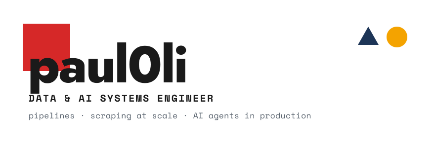
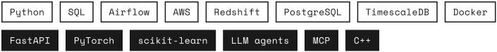

<!-- paul0li · GitHub profile README, Bauhaus. Light + dark via <picture>. -->

<picture>
  <source media="(prefers-color-scheme: dark)" srcset="assets/banner-dark.svg" />
  
</picture>

###  &nbsp;About

I design data systems and build them end to end, from the first conversation with the client to the pipeline running in production.

Lead Software Developer at Niuro, working for a US client: large-scale web scraping, an analytical model in Redshift, and LLM agents wired into the team's tools. Before that, CTO of a university startup (ANN-Water), where I built neural-network leak-risk prediction for water networks. YLAI Fellow 2025.

`B.Sc. + M.Sc. Computer Science & Engineering (in progress)` · Universidad de Chile

 

### <picture><source media="(prefers-color-scheme: dark)" srcset="assets/tri-dark.svg" /></picture> &nbsp;At work

> **Scraping & data platform:** built from zero coverage to **25–30K websites** and **12M records/day**, using a DB-backed job queue, TimescaleDB priority scheduling, parallel Docker workers, batch loads into Redshift via Airflow. It also cut about **USD 5K/month** in residential proxy costs.
>
> `Python · Airflow · AWS · Redshift · TimescaleDB · Docker` &nbsp;·&nbsp; *private client code*

 

###  &nbsp;Personal projects

AI pipelines where the model proposes, a deterministic pipeline does the work, and a human signs off.

| | Project | What | Stack |
| :-: | :-- | :-- | :-- |
| <picture><source media="(prefers-color-scheme: dark)" srcset="assets/tri-dark.svg" /></picture> | **[clip-creator](https://github.com/paul0li/clip-creator)** | A daily scheduled agent reads a podcast's livestream transcript and picks the moments; scripts download only those ranges and cut vertical clips. | `Python · Claude · FFmpeg` |
| <picture><source media="(prefers-color-scheme: dark)" srcset="assets/tri-dark.svg" /></picture> | **[Portada](https://github.com/paul0li/Portada)** | Podcast thumbnails assembled deterministically; AI is an optional finishing pass, never a dependency. Golden + architecture tests. | `Python · FastAPI · rembg` |

 

###  &nbsp;University & collaborations

| | Project | What | Stack |
| :-: | :-- | :-- | :-- |
|  | **[SafeCab](https://github.com/M4rb4r0/Proyecto-de-IA-safecab)** | Real-time detection of drivers using their phone, for vehicle fleets. Detection service and web app deployed as separate services. Team project. | `Python · YOLO · PyTorch` |
|  | **[credit-card-fraud](https://github.com/paul0li/credit-card-fraud)** | Fraud classifier on 1.3M transactions (0.58% fraud). Temporal split to avoid leakage, PR-AUC as the metric. | `pandas · scikit-learn` |
|  | **[r-tree-bulk-insert](https://github.com/paul0li/r-tree-bulk-insert)** | Disk-backed R-tree with 4 KB nodes. STR vs Nearest-X bulk-loading, benchmarked by disk I/O up to 2²⁴ points. | `C++17` |
|  | **[Redes](https://github.com/Nc-Maxt/Redes)** | HTTP server, HTTP proxy and DNS resolver built on raw sockets. Team project. | `Python · sockets` |

 

### Stack

<picture>
  <source media="(prefers-color-scheme: dark)" srcset="assets/stack-dark.svg" />
  
</picture>

 
 

### Contact

| | |
| :-- | :-- |
| **EMAIL**    | [pcjorquerabz@gmail.com](mailto:pcjorquerabz@gmail.com) |
| **TELEGRAM** | [@paul0li](https://t.me/paul0li) |
| **LINKEDIN** | [linkedin.com/in/paula-jorquera](https://linkedin.com/in/paula-jorquera) |

 

<picture>
  <source media="(prefers-color-scheme: dark)" srcset="assets/rule-dark.svg" />
  
</picture>
